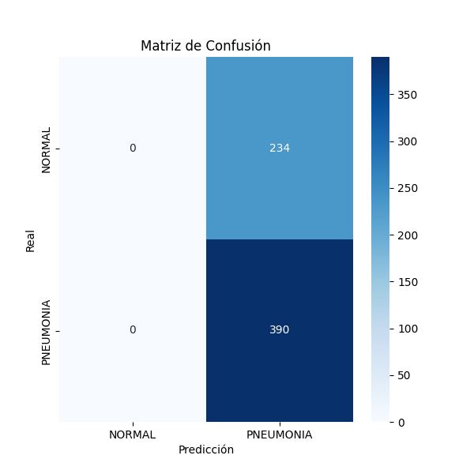

# Pneumonia Detection Using CNN in Keras

Este proyecto utiliza redes neuronales convolucionales (CNN) implementadas en Keras para detectar neumonía a partir de imágenes de rayos X de tórax. Está diseñado para abordar un problema de clasificación binaria: identificar si una imagen corresponde a un caso de neumonía o a un caso normal.

## Tabla de Contenidos

1. [Introducción](#introducción)
2. [Características del Proyecto](#características-del-proyecto)
3. [Requisitos Previos](#requisitos-previos)
4. [Estructura del Proyecto](#estructura-del-proyecto)
5. [Cómo Usar este Proyecto](#cómo-usar-este-proyecto)
6. [Entrenamiento del Modelo](#entrenamiento-del-modelo)
7. [Resultados](#resultados)

## Introducción

La neumonía es una infección pulmonar que puede ser potencialmente mortal si no se diagnostica y trata a tiempo. Este proyecto aplica técnicas de aprendizaje profundo para crear un modelo que pueda detectar neumonía de manera eficiente y rápida a partir de imágenes médicas, ayudando a los profesionales de la salud a tomar decisiones informadas.

## Características del Proyecto

- **Preprocesamiento de datos**: Conversión y normalización de imágenes.
- **Data augmentation**: Uso de `ImageDataGenerator` para mejorar el rendimiento y evitar sobreajuste.
- **Modelo CNN personalizado**: Arquitectura diseñada para maximizar la precisión.
- **Entrenamiento supervisado**: Evaluación mediante métricas de precisión, pérdida y validación cruzada.
- **Visualización de resultados**: Gráficos de rendimiento y distribución de clases.

## Requisitos Previos

Antes de comenzar, asegúrate de tener instaladas las siguientes herramientas:

- Python 3.6+
- TensorFlow y Keras
- Matplotlib
- Seaborn
- NumPy
- Pandas
- Jupyter Notebook o cualquier otro entorno compatible

## Estructura del Proyecto

```
├── data
│   ├── train  # Imágenes de entrenamiento
│   ├── test   # Imágenes de prueba
│   └── val    # Imágenes de validación
├── notebooks
│   └── pneumonia_detection.ipynb
├── src
│   ├── model.py       # Definición del modelo CNN
│   ├── preprocess.py  # Código para el preprocesamiento de datos
│   └── train.py       # Script para entrenar el modelo
├── requirements.txt   # Dependencias del proyecto
├── README.md          # Documentación del proyecto
└── results
    ├── accuracy_loss_plot.png
    └── confusion_matrix.png
```

## Cómo Usar este Proyecto

### 1. Clonar el repositorio

```bash
git clone https://github.com/tu-usuario/pneumonia-detection.git
cd pneumonia-detection
```

### 2. Instalar dependencias

```bash
pip install -r requirements.txt
```

### 3. Preparar los datos

Coloca las imágenes de rayos X en las carpetas `train`, `test` y `val` dentro del directorio `data`. Asegúrate de que las imágenes estén organizadas en subcarpetas por clase (`Pneumonia` y `Normal`).

### 4. Ejecutar el notebook

Abre y ejecuta el notebook `pneumonia_detection.ipynb` para entrenar y evaluar el modelo.

## Entrenamiento del Modelo

El modelo se entrena con las siguientes configuraciones principales:

- Optimizador: Adam
- Función de pérdida: `categorical_crossentropy`
- Épocas: 20
- Tamaño del batch: 32

El modelo se entrena utilizando el conjunto de datos de entrenamiento, y el desempeño se evalúa en el conjunto de validación.

### Gráficos de Entrenamiento

A continuación se incluyen gráficos de precisión y pérdida:


### Matriz de Confusión



## Resultados

Test Loss: 0.4699665606021881
Test Accuracy: 0.8349359035491943
Test AUC: 0.9161844849586487
